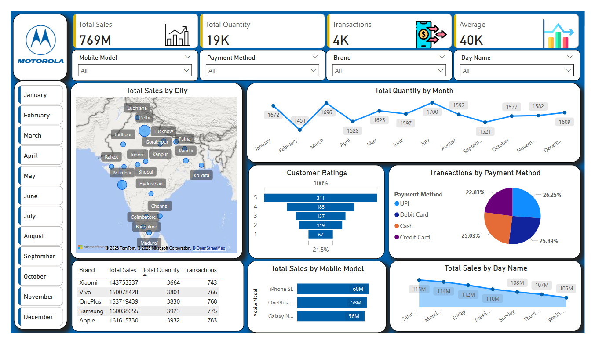

# Mobile Sales Dashboard (Power BI)

## 📊 Project Overview

This project analyzes **mobile phone sales performance across different cities, brands, payment methods, and time periods** using **Power BI**.

The dashboard helps understand **sales trends, customer purchasing behavior, and brand performance** to support better business decision-making.

---

## 🛠 Tools & Technologies Used

* **Power BI**
* **Power Query (Data Cleaning)**
* **DAX Measures**
* **Data Visualization**

---

## 📁 Dataset

The dataset contains mobile sales transaction data including:

* Mobile Brand
* Mobile Model
* City
* Sales Amount
* Quantity Sold
* Payment Method
* Transaction Date
* Customer Ratings

The dataset is provided in **Excel (.xlsx) format**.

---

## 📥 Download Power BI File

You can download the Power BI project file from this repository:

[Download Power BI Dashboard](Mobile_Sales_Dashboard.pbix)

---

## 📈 Dashboard Preview

---

## 🔍 Key Insights

### 💰 Overall Sales Performance

* **Total Sales:** 769M
* **Total Quantity Sold:** 19K units
* **Total Transactions:** 4K
* **Average Sales Value:** 40K per transaction

This indicates strong demand for mobile devices across different regions.

---

### 🏙 Sales by City

The dashboard map shows that **major metropolitan cities such as Mumbai, Delhi, Hyderabad, and Bangalore generate higher sales** compared to smaller cities.

Urban markets contribute significantly to total revenue.

---

### 📅 Monthly Sales Trend

Mobile sales fluctuate throughout the year:

* **Highest sales month:** July (~1700 units sold)
* Strong sales also observed in **March and January**
* Sales dip slightly during **February and September**

This suggests **seasonal demand patterns** in mobile purchases.

---

### ⭐ Customer Ratings

Customer satisfaction distribution:

* Rating **5 → 311 customers**
* Rating **4 → 185 customers**
* Rating **3 → 137 customers**
* Rating **2 → 119 customers**
* Rating **1 → 67 customers**

Most customers give **high ratings (4–5)**, indicating generally positive product experiences.

---

### 💳 Transactions by Payment Method

Payment distribution shows that **digital payments dominate**
